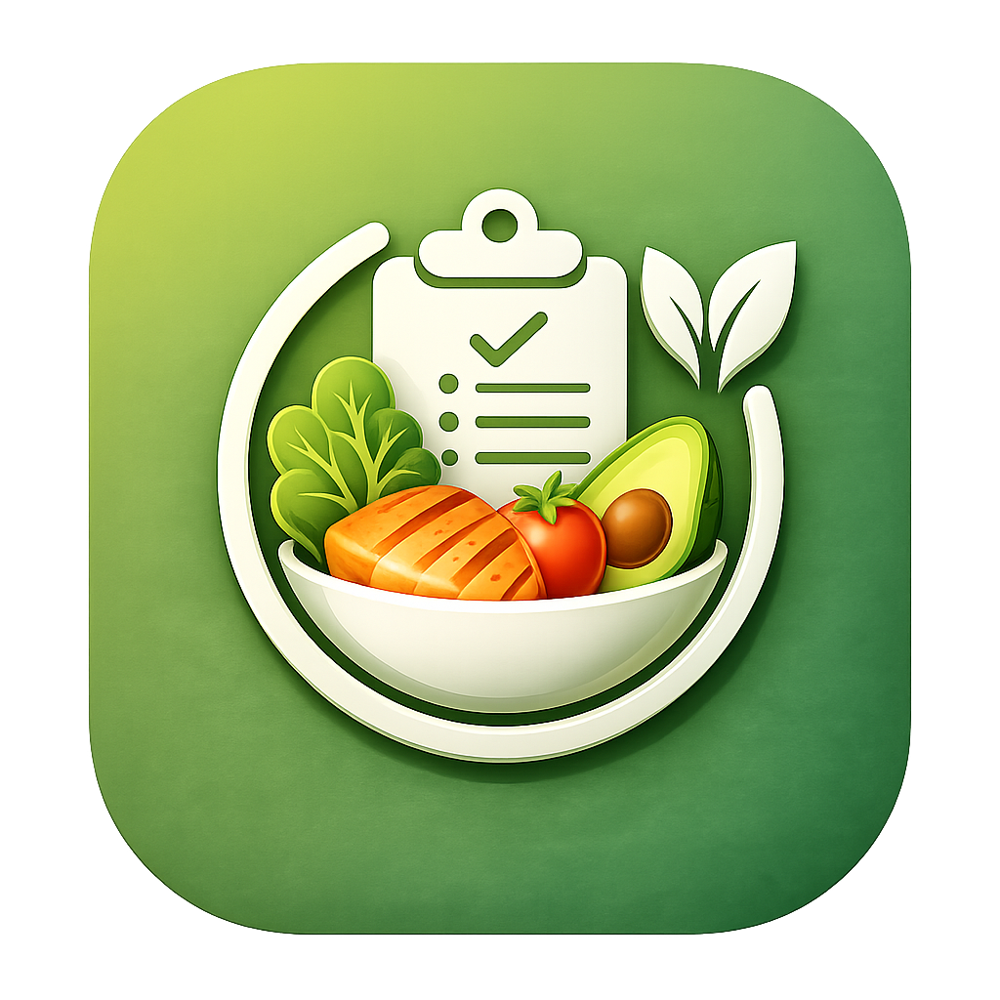

# DietProGuide Site

Landing page oficial do **DietProGuide**, um aplicativo de acompanhamento nutricional criado para ajudar pessoas a registrarem refeições, acompanharem metas diárias, controlarem hidratação e visualizarem sua evolução alimentar com mais clareza.



## Sobre o Projeto

O site apresenta os principais recursos do aplicativo DietProGuide em uma página estática feita com **HTML, CSS e JavaScript puro**. A interface foi construída para destacar as telas reais do app, explicar os benefícios principais e oferecer um fluxo simples de download do APK.

## Recursos Apresentados

- Metas personalizadas de calorias, proteínas, carboidratos, gorduras e água.
- Registro de refeições por momentos do dia.
- Controle de hidratação diária.
- Biblioteca de alimentos salvos.
- Scanner de tabela nutricional com OCR.
- Acompanhamento de progresso.
- Lembretes para água, refeições e pesagem.
- Sistema de conquistas para incentivar consistência.

## Tecnologias

- HTML5
- CSS3
- JavaScript
- GitHub Pages

## Estrutura

```text
.
├── index.html
├── styles.css
├── script.js
├── icon.png
└── imagens app/
    └── screenshots do aplicativo
```

## Como Abrir Localmente

Como o projeto é estático, basta abrir o arquivo `index.html` no navegador.

Também é possível usar uma extensão como Live Server no VS Code, se preferir.

## Publicação no GitHub Pages

Para publicar:

1. Acesse `Settings` no repositório.
2. Entre em `Pages`.
3. Em `Build and deployment`, selecione `Deploy from a branch`.
4. Escolha a branch `main`.
5. Escolha a pasta `/root`.
6. Salve.

Depois da publicação, o site ficará disponível em:

```text
https://matheusrocha-x.github.io/DietProGuideSite/
```

## Download

O botão de download abre um modal com uma mensagem de agradecimento, opção de copiar Pix para apoio voluntário e o botão final para baixar o APK.

## Aviso

O DietProGuide é uma ferramenta de apoio ao acompanhamento nutricional. Ele não substitui orientação individual de um profissional de saúde ou nutrição.

